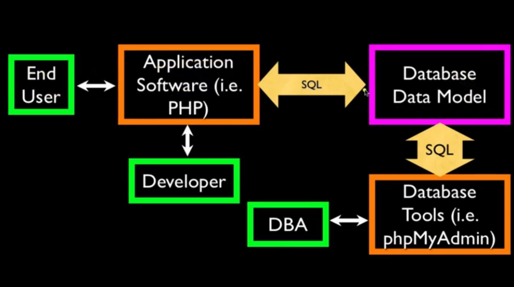
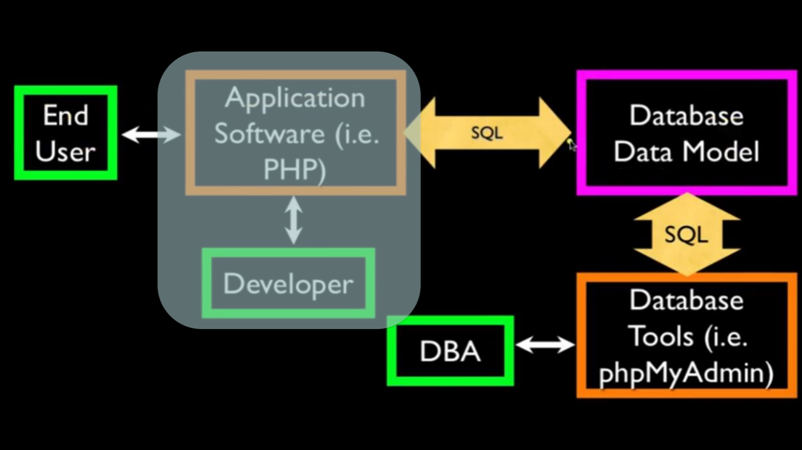
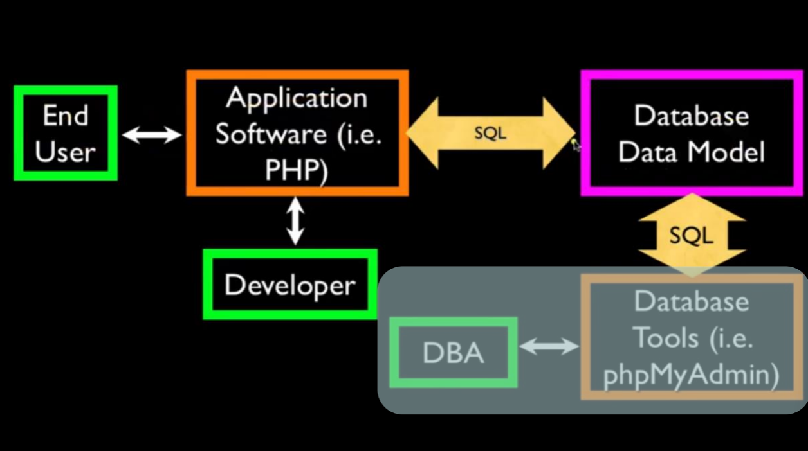
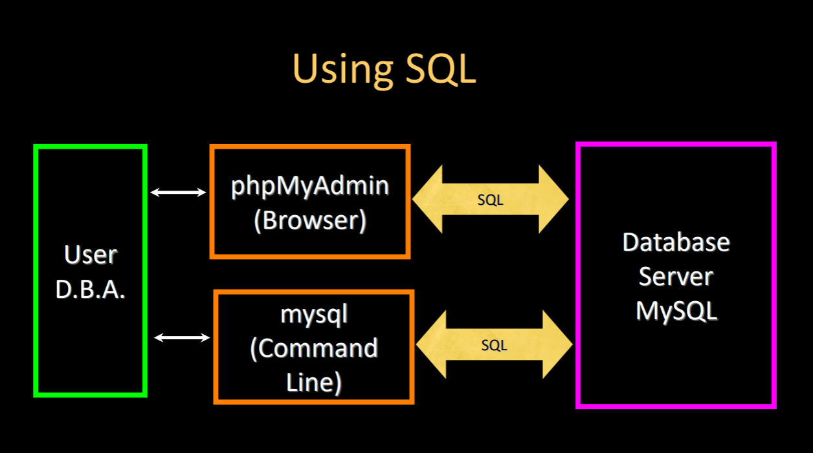

# Database MySQL

## Introduction:

- Database Management System (DBMS)
- MySQL - Open-source relational database management system
- Widely used for web applications
- Supports SQL (Structured Query Language)
- Ideal for storing structured data
- Cross-platform compatibility

## Types of Databases:

- Relational Databases (RDBMS): Data stored in tables with relationships (e.g., MySQL, PostgreSQL, Oracle)
- NoSQL Databases: Non-relational databases for unstructured data (e.g., MongoDB, Cassandra)

## Terminology:

- Database: A collection of organized data
- Relation (Table): A structured format for storing data in rows and columns
- Tuple (Row): A single record in a table
- Attribute (Column): A field in a table that holds data

## SQL

- Structured Query Language
- Used to interact with relational databases
- Common SQL commands:

  - `CREATE`: Create a new database or table
  - `ALTER`: Change the structure of a table
  - `DROP`: Delete a database or table
  - `SELECT`: Retrieve data from a table
  - `INSERT`: Add new data to a table
  - `UPDATE`: Modify existing data in a table
  - `DELETE`: Remove data from a table

  ## Common Databases:

- Three major DBMS widely used:

  - MySQL: Open-source, widely used for web applications
  - Oracle: Commercial RDBMS with advanced features
  - Microsoft SQL Server: Commercial RDBMS by Microsoft

- Many other smaller projects, free and open source:
  - Firebase: Cloud-based NoSQL database by Google
  - MongoDB: NoSQL database for unstructured data
  - HSQL: Lightweight, file-based database
  - SQLite: Embedded database engine, often used in mobile apps
  - PostgreSQL: Advanced open-source RDBMS with support for complex queries

## Command Line Interface (CLI):

- MySQL provides a command-line interface for database management
- Common commands in MySQL CLI:
  - `mysql -u username -p`: Connect to MySQL server
  - `SHOW DATABASES;`: List all databases
  - `USE database_name;`: Select a database to work with
  - `SHOW TABLES;`: List all tables in the selected database
  - `DESCRIBE table_name;`: Show the structure of a table
  - `SELECT * FROM table_name;`: Retrieve all records from a table

## Getting Started with MySQL:






- Install MySQL server (e.g., using XAMPP, Laragon, or standalone installation)
- Start the MySQL server
- Open the MySQL command line or use a GUI tool (e.g., phpMyAdmin, MySQL Workbench)
- Create a new database using `CREATE DATABASE database_name;`
- Create a new table using `CREATE TABLE table_name (column1 datatype, column2 datatype, ...);`
- Insert data into the table using `INSERT INTO table_name (column1, column2) VALUES (value1, value2);`

## Basic SQL Example:

- Create a new database and table:

  ```sql
  CREATE DATABASE my_database;                        -- Create a new database
  USE my_database;                                    -- Select the database to use
  CREATE TABLE users (                                -- Create a new table `users`
      id INT AUTO_INCREMENT PRIMARY KEY,              -- Primary key for the table
      name VARCHAR(100) NOT NULL,                     -- Name column with a maximum length of 100 characters
      email VARCHAR(100) NOT NULL UNIQUE,             -- Email column with a maximum length of 100 characters, must be unique
      created_at TIMESTAMP DEFAULT CURRENT_TIMESTAMP  -- Timestamp column with default value as current time
  );
  ```

- Insert data into the `users` table:

  ```sql
  INSERT INTO users (name, email) VALUES ('Alice', 'alice@example.com');  -- Insert a new user
  INSERT INTO users (name, email) VALUES ('Bob', 'bob@example.com');      -- Insert another user
  ```

- Bulk insert data into the `users` table:

  ```sql
  INSERT INTO users (name, email) VALUES
      ('Charlie', 'charlie@example.com'),
      ('David', 'davi@example.com'),
      ('Eve', 'eve@example.com');
  ```

- Retrieve data from the `users` table:

  ```sql
  SELECT * FROM users;  -- Retrieve all records from the `users` table
  ```

- Update data in the `users` table:

  ```sql
  UPDATE users SET email = 'david@example.com' WHERE name = 'David';  -- Update David's email
  ```

- Delete data from the `users` table:

  ```sql
  DELETE FROM users WHERE name = 'Eve';  -- Delete the user named Eve
  ```

- Drop the `users` table:

  ```sql
  DROP TABLE users;  -- Delete the `users` table
  ```

- Drop the database:

  ```sql
  DROP DATABASE my_database;  -- Delete the `my_database` database
  ```

## Aggregation Functions:

- SQL provides functions to perform calculations on data:

  - `COUNT()`: Count the number of rows
    ```sql
    SELECT COUNT(*) FROM users;  -- Count all users in the `users` table
    ```
  - `SUM()`: Calculate the sum of a numeric column
    ```sql
    SELECT SUM(column_name) FROM table_name;  -- Sum of values in a numeric column
    ```
  - `AVG()`: Calculate the average value of a numeric column
    ```sql
    SELECT AVG(column_name) FROM table_name;  -- Average of values in a numeric column
    ```
  - `MIN()`: Find the minimum value in a column
    ```sql
    SELECT MIN(column_name) FROM table_name;  -- Minimum value in a column
    ```
  - `MAX()`: Find the maximum value in a column
    ```sql
    SELECT MAX(column_name) FROM table_name;  -- Maximum value in a column
    ```

- Examples of few logical operations:

  ```sql
  SELECT COUNT(*) AS total_users, AVG(age) AS average_age FROM users;  -- Count total users and calculate average age
  ```

- Grouping data with `GROUP BY`:

  ```sql
  SELECT age, COUNT(*) AS count FROM users GROUP BY age;  -- Count users by age
  ```

- Ordering results with `ORDER BY`:

  ```sql
  SELECT * FROM users ORDER BY created_at DESC;  -- Retrieve all users ordered by creation date (newest first)
  ```

- Filtering results with `WHERE`:

  ```sql
  SELECT * FROM users WHERE email LIKE '%@example.com';  -- Retrieve users with emails ending in '@example.com'
  ```

- Combining conditions with `AND`, `OR`, and `NOT`:

  ```sql
  SELECT * FROM users WHERE age > 18 AND email LIKE '%@example.com';  -- Retrieve users older than 18 with specific email domain
  SELECT * FROM users WHERE age < 18 OR email LIKE '%@example.com';   -- Retrieve users younger than 18 or with specific email domain
  SELECT * FROM users WHERE NOT email LIKE '%@example.com';           -- Retrieve users whose emails do not end with '@example.com'
  ```

- Using `LIMIT` to restrict the number of results:

  ```sql
  SELECT * FROM users LIMIT 10;  -- Retrieve only the first 10 users
  ```

- Using `OFFSET` to skip a number of rows:

  ```sql
  SELECT * FROM users LIMIT 10 OFFSET 5;  -- Retrieve 10 users, skipping the first 5
  ```

- Using `DISTINCT` to get unique values:

  ```sql
  SELECT DISTINCT email FROM users;  -- Retrieve unique email addresses from the `users` table
  ```

- Using `HAVING` to filter grouped results:

  ```sql
  SELECT age, COUNT(*) AS count FROM users GROUP BY age HAVING count > 1;  -- Retrieve ages with more than one user
  ```

- Using sub query:

  ```sql
  SELECT name FROM users WHERE id IN (SELECT user_id FROM orders WHERE amount > 100);  -- Retrieve names of users with orders over $100
  ```

## Conclusion:

- MySQL is a powerful and widely used relational database management system.
- It provides a robust set of features for managing structured data.
- SQL is the standard language for interacting with MySQL databases.

## Learn by Doing:

- https://tinyurl.com/iims-sql-qn-1
- https://shorturl.at/6Xc5q
