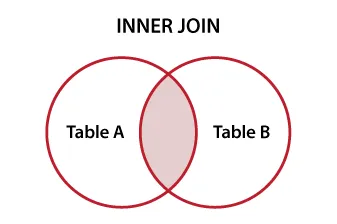
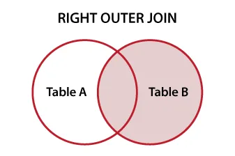
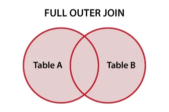

# MySQL Joins

Joins are used to combine rows from two or more tables based on a related column between them. They are essential for querying data across multiple tables in a relational database.

## Types of Joins

### 1. INNER JOIN



Returns records that have matching values in both tables.

```sql
SELECT users.name, orders.amount
FROM users
INNER JOIN orders ON users.id = orders.user_id;
```

### 2. LEFT JOIN (or LEFT OUTER JOIN)


Returns all records from the left table and the matched records from the right table. If there is no match, NULL values are returned for columns from the right table.

```sql
SELECT users.name, orders.amount
FROM users
LEFT JOIN orders ON users.id = orders.user_id;
```

### 3. RIGHT JOIN (or RIGHT OUTER JOIN)



Returns all records from the right table and the matched records from the left table. If there is no match, NULL values are returned for columns from the left table.

```sql
SELECT users.name, orders.amount
FROM users
RIGHT JOIN orders ON users.id = orders.user_id;
```

### 4. FULL JOIN (or FULL OUTER JOIN)



Returns all records when there is a match in either left or right table records. If there is no match, NULL values are returned for columns from the table that does not have a match.

```sql
SELECT users.name, orders.amount
FROM users
FULL JOIN orders ON users.id = orders.user_id;
```

### 5. CROSS JOIN

Returns the Cartesian product of both tables, meaning it returns all possible combinations of rows from both tables

```sql
SELECT users.name, orders.amount
FROM users
CROSS JOIN orders;
```

### 6. SELF JOIN

A self join is a regular join but the table is joined with itself.

```sql
SELECT a.name AS Employee, b.name AS Manager
FROM employees a
INNER JOIN employees b ON a.manager_id = b.id;
```

### 7. NATURAL JOIN

A natural join automatically joins tables based on columns with the same name and compatible data types.

```sql
SELECT users.name, orders.amount
FROM users
NATURAL JOIN orders;
```

## Advanced Join Techniques

### 1. JOIN with Multiple Conditions

You can join tables using multiple conditions by combining them with `AND` or `OR`.

```sql
SELECT users.name, orders.amount
FROM users
JOIN orders ON users.id = orders.user_id AND orders.status = 'completed';
```

### 2. JOIN with Aliases

Using aliases can make your queries more readable, especially when dealing with multiple tables.

```sql
SELECT u.name, o.amount
FROM users AS u
JOIN orders AS o ON u.id = o.user_id;
```

### 3. JOIN with Subqueries

You can use subqueries in joins to filter or aggregate data before joining.

```sql
SELECT u.name, o.amount
FROM users AS u
JOIN (SELECT user_id, SUM(amount) AS total_amount FROM orders GROUP BY user_id)
AS o ON u.id = o.user_id
WHERE o.total_amount > 100;
```

### 4. USING Clause

The `USING` clause is used to specify the column(s) that should be used for the join condition. It is a shorthand for specifying the join condition when the column names are the same in both tables.

```sql
SELECT users.name, orders.amount
FROM users
JOIN orders USING (user_id); -- This assumes both `users` and `orders` have a column named `user_id`.
```

### 5. JOIN with Multiple Tables

You can join more than two tables in a single query by chaining multiple joins together.

```sql
SELECT u.name, o.amount, p.product_name
FROM users AS u
JOIN orders AS o ON u.id = o.user_id
JOIN products AS p ON o.product_id = p.id;
```

## Conclusion

- Joins are a powerful feature in SQL that allow you to combine data from multiple tables based on related columns.
- Understanding different types of joins (INNER, LEFT, RIGHT, FULL, CROSS, SELF, NATURAL) is crucial for effective data retrieval.
- Advanced techniques like using aliases, subqueries, and multiple conditions can enhance the flexibility and readability of your SQL queries.
- Mastering joins is essential for working with relational databases and performing complex data analysis.

## Learn by Doing

- https://tinyurl.com/iims-sql-qn-2
