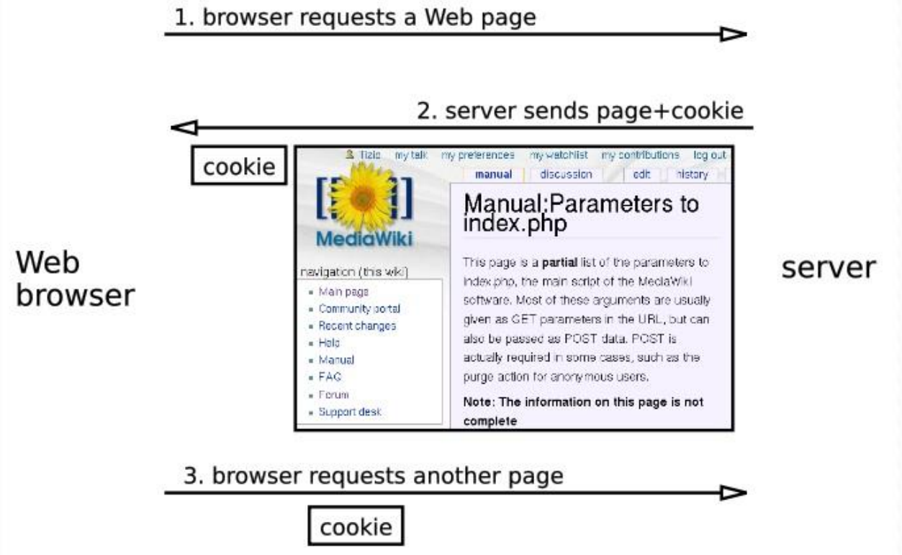
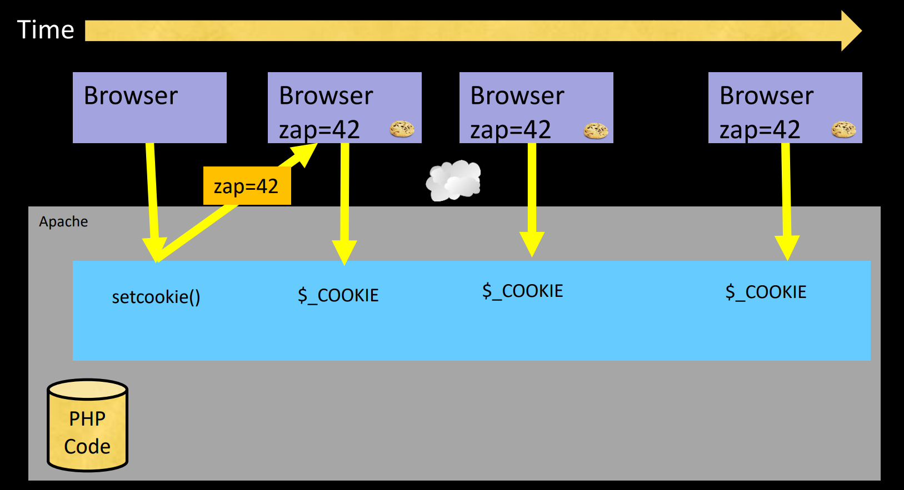
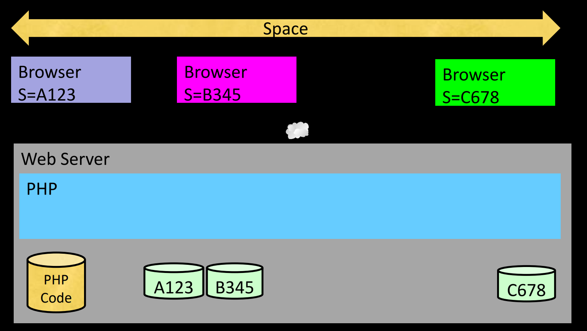
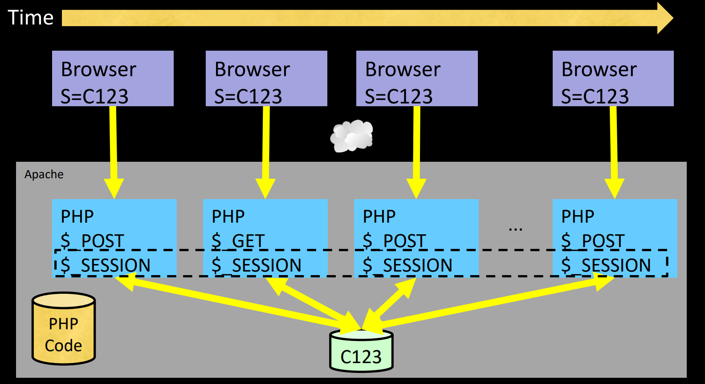

# Cookies and Sessions

## Cookies

Cookies are small pieces of data stored on the client side that can be used to remember information about the user. They are often used for session management, personalization, and tracking.

### How Cookies Work

When a user visits a website, the server can send cookies to the user's browser. The browser stores these cookies and sends them back to the server with each subsequent request. This allows the server to recognize returning users and maintain state across requests.



### Use Cases for Cookies

- **Session Management**: Cookies can store session identifiers to keep track of user sessions.
- **Personalization**: Cookies can remember user preferences, such as language settings or theme choices.
- **Tracking**: Cookies can be used to track user behavior across different pages or sessions, enabling analytics and targeted advertising.

### Types of Cookies

- **Session Cookies**: These are temporary cookies that are deleted when the user closes their browser. They are used to maintain state during a single session.
- **Persistent Cookies**: These cookies remain on the user's device for a specified period or until they are deleted. They are used for remembering user preferences or login information across sessions.
- **Secure Cookies**: These cookies are only sent over secure HTTPS connections, providing an additional layer of security.
- **HttpOnly Cookies**: These cookies cannot be accessed via JavaScript, which helps mitigate the risk of cross-site scripting (XSS) attacks.

### Cookie Attributes

Cookies can have several attributes that control their behavior:

- **Domain**: Specifies which domain can access the cookie.
- **Path**: Specifies the URL path that must exist in the requested URL for the browser to send the cookie.
- **Expires/Max-Age**: Defines when the cookie should expire. If not set, the cookie is a session cookie and will expire when the browser is closed.
- **Secure**: Indicates that the cookie should only be sent over secure HTTPS connections.
- **HttpOnly**: Prevents JavaScript from accessing the cookie, enhancing security against XSS attacks.

### Setting a Cookie

To set a cookie in a web application, you can use the `Set-Cookie` header in the HTTP response. Here’s an example in a PHP application:

```php
setcookie("username", "JohnDoe", time() + (86400 * 30), "/"); // 86400 = 1 day
```

### Reading a Cookie

To read a cookie, you can access the `$_COOKIE` superglobal in PHP:

```php
if(isset($_COOKIE["username"])) {
    echo "Username: " . $_COOKIE["username"];
} else {
    echo "Username cookie is not set.";
}
```

### Deleting a Cookie

To delete a cookie, you can set its expiration time to a past date:

```php
setcookie("username", "", time() - 3600, "/");
```



## Sessions

Sessions are a way to store data on the server side that is associated with a specific user. Unlike cookies, which store data on the client side, sessions keep data on the server and use a session identifier to link the user to their session data.

### How Sessions Work

When a user initiates a session (e.g., by logging in), the server creates a session record and generates a unique session ID. This session ID is sent to the user's browser as a cookie. With each subsequent request, the browser sends the session ID back to the server, allowing the server to retrieve the associated session data.



### Use Cases for Sessions

- **User Authentication**: Sessions are commonly used to keep users logged in after they authenticate.
- **Shopping Carts**: E-commerce websites use sessions to store shopping cart items for each user.
- **Temporary Data Storage**: Sessions can hold temporary data that is not suitable for long-term storage in cookies or databases.

### Session Management in PHP

In PHP, sessions are managed using the `$_SESSION` superglobal. Here’s how to work with sessions in PHP:

#### Starting a Session

To start a session, call the `session_start()` function at the beginning of your script:

```php
session_start();
```

#### Storing Data in a Session

You can store data in a session by assigning values to the `$_SESSION` superglobal:

```php
$_SESSION["username"] = "JohnDoe";
```

#### Retrieving Data from a Session

To retrieve data from a session, simply access the `$_SESSION` superglobal:

```php
if(isset($_SESSION["username"])) {
    echo "Username: " . $_SESSION["username"];
} else {
    echo "Username session variable is not set.";
}
```

#### Destroying a Session

To destroy a session and delete all associated data, use the `session_destroy()` function:

```php
session_start();
session_destroy();
```

#### Regenerating Session IDs

To enhance security, especially after a user logs in, you can regenerate the session ID to prevent session fixation attacks:

```php
session_start();
session_regenerate_id(true); // true to delete the old session
```


